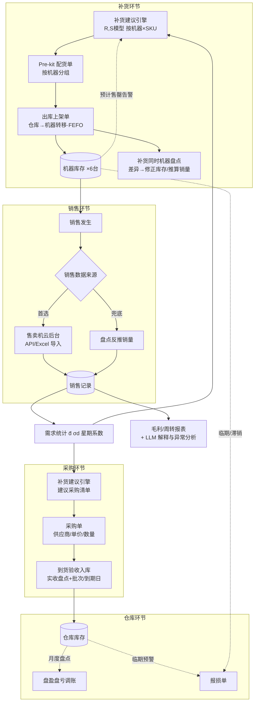
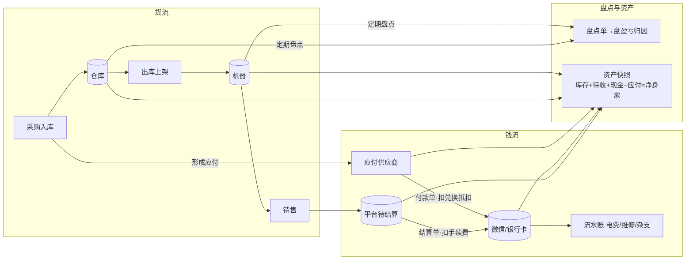
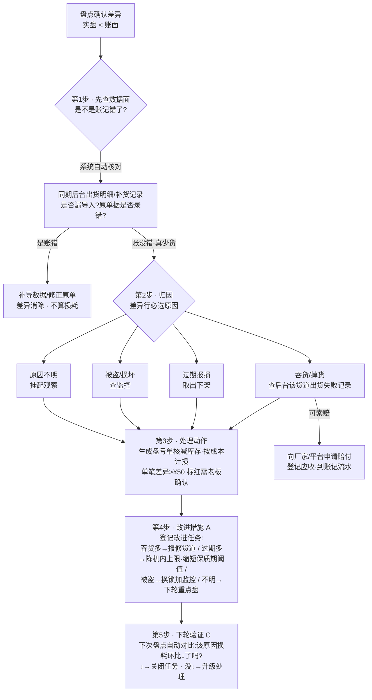
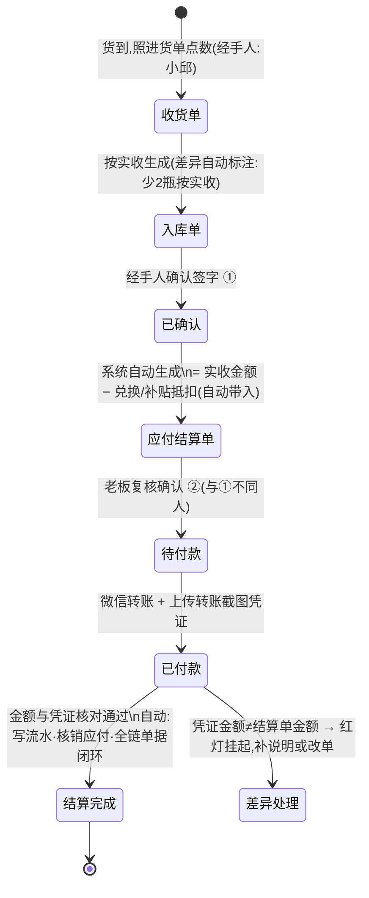

# 园区自动售卖机管理系统 · 调研报告

> 项目:智慧园区子系统 · 自动售卖机进销存与 AI 补货
> 日期:2026-08-05 · 版本 v1.8(新增 §13 穿行审计修正案·效力高于前文;§12 AI 接入;§11 完备性;§10 BI;§9 业财一体;§8 PDCA;§7 钱流)
> 场景锚定:单一园区 · 5-6 台售卖机 · SKU 约 70-110 个(饮料/泡面/面包/卤味/槟榔等)· 无需登录权限(嵌入智慧园区大系统)· 现有售卖机后台:fanmaiji.top(广州易普乐)

---

## 0. 一页结论(先看这里)

1. **没有能"拿来就用"的开源系统,建议自研轻量模块。** 售卖机运营方向的开源项目要么太小、要么是冻结的培训项目;进销存开源系统(jshERP/InvenTree 等)功能对口但都自带完整登录/权限/财务体系,裁剪成本大于自研。你的场景本质是:**约 8-10 张表 + 4-5 个页面 + 1 个补货算法**,自研 2-4 周量级。
2. **但值得"抄"的设计非常明确**:售卖机域的标准数据模型是「机器 → 货道(slot) → 商品 → 补货工单」四层(抄立可得/MySmallShop);进出库单据用「单据头+单据明细」两张表通吃所有单据类型(抄 jshERP);补货提示的产品定义用 min/max 规则(抄 Odoo Reordering Rule)。
3. **商业系统的"智能补货"分三档**:L1 低库存阈值提醒 → L2 按消耗速率预测售罄日 → L3 动态调度+预拣配(Cantaloupe 式)。国内中小 SaaS 多停在 L1;**本项目做 L2 + 简化版 L3(pre-kit 配货单)最合算**,正好是差异化空间。
4. **AI 补货的正确姿势 = 规则引擎出数字,LLM 出解释。** 核心算法是教科书级的「周期补货 (R,S) 模型 + 安全库存」,几十行代码、每个数字可解释;你要的"自定义补货周期 15/7/30 天"正好就是模型参数 R。LLM 只做补货理由的人话解释、异常分析、周报摘要——不让 LLM 直接算数。
5. **现有业务流有 5 个关键缺口**要补:①销售数据来源(已确认 = 售卖机后台导出/对接,见 §1);②仓库库存和机器库存要分开记两级(现有 Excel 里"出库补货表"没用起来,库存台账已出现 −75 的负库存);③成本/毛利核算(Excel 里已经在做,新系统要接过来自动化);④缺报损/过期等逆向流程(兑换/退款/补贴目前散记在"特殊项目"表);⑤缺盘点对账机制。详见 §5。
6. **现状 Excel 套表解剖出的第一手工痛点是"商品名称两套体系"**:售卖机后台的销售商品名 ≠ 采购商品名,目前靠人工维护"配比采购销售编码底稿"逐条归集——新系统必须内建 SKU 别名映射,这是自动化的第一关。详见 §1。
7. **后台实地摸底带来两个减负惊喜**(附录 B):①后台有货道级实时库存(4 台机、71-79 货道/台);②后台完整记录每次补货(精确到货道,可导出)——**销售和出库上架两类数据都能从后台导入,新系统日常只需手工录"采购入库"一种单据**,录入负担比预想低一个量级。
8. **v1.2 补全"钱流+盘点+资产"三条线**(§7):只管货不管钱的进销存回答不了"赚没赚、钱在哪"。新增四块:①应付供应商(拿货款−兑换抵扣=实付,Excel 里已有 3 笔真实付款证据);②平台代收货款对账(卖出的钱 → 平台结算到账,含手续费);③盘点(仓库+机器,盘盈亏归因);④资产快照(库存+待收货款+现金−应付=净身家)。原则:**单据即台账、余额可推算,不做会计科目/凭证**——老板看得懂的钱账。
9. **v1.3 给每个环节装上 PDCA 循环**(§8):盘亏处理五步流程(先查账→归因→处理/索赔→改进→下轮验证)、月度财务盘点 SOP(每月 1 日半天,货盘+钱盘+自动报告+定改进)、六环节 PDCA 总表。落地手段极简:**一张改进任务表 + 一个「改进循环」页面**,所有改进措施带验证指标和期限,到期自动回查——管理动作从"说过就忘"变成"下月见分晓"。

---

## 1. 现状盘点(基于现有 Excel 套表 + 售卖机后台)

> 学习材料:`小卖铺数据表8.4/` 下三个文件——《自助售卖机业务进销存套表(更新8.1).xlsx》(13 个 sheet,当前的手工 ERP)、《7.27拿货数量价格(小邱统计表).xls》、《原供应商采购费用明细.xlsx》。

### 1.1 现有工作流全貌(= 手工版进销存系统)

| 环节 | 现在怎么做 | 载体 |
|---|---|---|
| 商品主数据 | 约 110 个 SKU(编码 SP001…),记进货价/整件规格;售价、保质期多为空 | 商品档案 sheet |
| 供应商 | 3 家:蔡彩云(6.23-7.14)→ 陈老板(7.15-,微信对接)→ 拼多多自购;换供应商、同品多次拿货价不同是常态 | 供应商档案 + 小邱统计表 + 原供应商费用明细 |
| 采购入库 | 按入库日期逐行记:供应商/商品/整件数/数量/单价/金额 | 采购入库表(123 行) |
| 出库上架 | **有表无数据——两级库存实际没落地**,库存台账 = 采购 − 销售一级账 | 使用说明里列了"出库补货表",workbook 里没用 |
| 销售 | **从售卖机后台(fanmaiji.top)导出明细**:商品名/条码/出货数量/货道号/设备ID/金额/订单号/支付方式/出货时间,6-7 月已有 5000+ 笔 | 销售明细表 |
| 名称归集 | **人工维护映射**:后台销售名("达利园和其正600l")→ 采购编码(SP006 和其正550ml),再算成本和毛利 | 配比采购销售编码底稿(88 行) |
| 毛利核算 | 按 SKU 算销售额/成本/利润/毛利率(多数 SKU 毛利率 32%-52%) | 销售毛利表 |
| 库存 | 月度进销存汇总(期初/入库/出库/期末);**已出现负库存**(茶派蜜桃乌龙 −75,标"缺货") | 库存台账 + 进销存汇总表 |
| 盘点 | 月末盘点表已建好(账面/实盘/差异/原因),**还没填过数** | 月末盘点表 |
| 特殊业务 | 兑换奖、退款、厂家补贴、测试出货、**机器故障期间线下收款(系统无出货记录,手工记收入)** | 特殊项目 + 兑换奖 + 售卖机坏了支出 |
| 定价 | 单独一张"售卖价格"表,部分商品未定价 | 小邱统计表 |

### 1.2 解剖出的核心痛点(新系统的第一优先级需求)

1. **商品名称两套体系,归集全靠人工**。售卖机后台录入的商品名和采购名不一致(甚至同一商品在后台有多个名字:"健力宝橙蜜味560ml"/"健力宝橙蜜运动饮料550ml"都归 SP009),每月要人工把 80+ 个销售名映射到采购编码才能算成本毛利。→ 新系统建 **SKU 别名表**(一个采购 SKU 挂多个销售名/条码),导入销售明细时自动归集,遇到新名字提示人工绑定一次、终身生效。
2. **两级库存没落地**:补货上架没有记录,分不清"仓库还剩多少"和"机器里还剩多少",负库存无从追查。→ 出库上架单(仓库→机器转移)必须是一等公民。
3. **负库存/账实不符无预警**:−75 的库存在 Excel 里只能靠人眼发现。→ 自动校验+告警。
4. **非正常交易散落**:兑换、退款、补贴、测试、机器故障线下卖,各记各的小表。→ 统一为"特殊单据"类型(销售明细里本就有"订单类型"字段可利用),手工补录销售入口要保留。
5. **采购价波动没有历史**:同品第一次/第二次拿货价不同、供应商更换,现在靠备注。→ 采购价随单记录,自动生成价格历史(比价、移动加权成本都靠它)。

### 1.3 售卖机后台(fanmaiji.top)数据源

后台为广州易普乐信息科技的「自动售货机 SAAS 系统」,已登录实地摸底(详见附录 B)。三个改变设计的关键发现:

1. **后台有货道级实时库存**:「缺货机器」页显示每台机的货道数(实际 71-79 道/台)、库存总容量、现有库存数、缺货数——机器层库存不需要我们自己记账,可与后台核对。
2. **后台完整记录每次补货动作**:「系统补货记录」精确到货道级(货道号/商品/补货前库存/本次补货数/补货后库存/补货人/时间),且可导出——**"出库上架"数据同样可以从后台导入,不必手工录单**。这大幅简化了新系统的录入负担:两级库存的"机器侧"进出全部自动化。
3. **后台的销售利润报表是废的**:商品成本价字段没人维护,毛利率全显示 100%——这正是要自研系统的核心理由:**成本和毛利只能靠自己的采购数据算**。

销售数据:「出货明细」逐笔可查(订单号/货道号/支付方式等 13 字段),**查询仅限当月+上月,导出支持一年范围**——新系统按月导入,别丢数据。

---

## 2. 开源项目盘点

### 2.1 自动售卖机管理平台类

| 项目 | 地址 | Star | 技术栈 | 匹配度 | 结论 |
|---|---|---|---|---|---|
| **MySmallShop** | gitee.com/mysmallshop | ~23 | Java(eladmin) + 微信小程序 + Web 后台 | **高** | 全网少见的完整售货机运营系统,业务模型与本需求几乎一一对应;但社区小、绑 eladmin 权限体系 |
| **立可得 lkd**(黑马培训项目) | gitee 搜 lkd_parent(多镜像) | 小 | Java 11 + Spring Cloud + MQTT | **高**(仅作参考) | 国内最标准的"售货机运营域建模"教材:机型→设备→货道→商品→补货工单→结算全链路,文档极全;代码冻结不建议复用 |
| temoto/vender | github.com/temoto/vender | 90 | Go(树莓派+MDB 协议) | 低 | 偏硬件控制层,不需要 |
| dujiaoka 独角数卡 | github.com/assimon/dujiaoka | 12.1k | PHP Laravel | 低 | 名字带"自动售货"但卖虚拟卡密,**排除项防误选** |
| wzhShop | github.com/vxutianmo/wzhShop | 3 | Vue + 公众号 | 低 | 只有消费端,2019 停更 |

> 小结:实体售卖机"运营管理后台"没有高 star 成熟开源项目(商业公司都闭源),MySmallShop 和立可得是仅有的两个业务完整参考。

### 2.2 轻量进销存 / 库存管理类

| 项目 | 地址 | Star | 技术栈 | 匹配度 | 可借鉴点 |
|---|---|---|---|---|---|
| **jshERP**(管伊佳ERP) | github.com/jishenghua/jshERP | ~4.5k | Spring Boot + Vue + MySQL | 中高 | **进销存单据模型**:单据头(depot_head)+单据明细(depot_item)两张表通吃入库/出库/调拨全部单据类型;非常活跃(2026-08 仍有提交) |
| **InvenTree** | github.com/inventree/InvenTree | ~7.3k | Python Django + React | 中 | **树形库位模型**:把每台售卖机建成一个 Location,"上架"就是一次库位间调拨,库存流水全程可追溯;低库存告警实现 |
| **Grocy** | github.com/grocy/grocy | ~9.4k | PHP + SQLite | 中 | **"最小库存 → 自动生成补货清单"的交互设计**(正是 AI 补货提示的手动版基线);快消品+保质期字段设计 |
| Finer PSI | gitee.com/FINERME/psi | ~5k | Spring Boot + jeecgboot | 中 | 绑死低代码平台,改造成本高;仓库/批次字段设计可参考 |
| Odoo / ERPNext | github.com/odoo/odoo 等 | 53k/37k | Python | 低 | 杀鸡用牛刀;但 Odoo 的 **Reordering Rule(min/max 再订货规则)** 是补货提示可直接照抄的产品定义 |

### 2.3 补货 / 需求预测算法库

| 项目 | Star | 匹配度 | 用法 |
|---|---|---|---|
| **stockpyl**(供应链教授出品) | 168 | **高** | (r,Q)/(s,S)/安全库存的教科书级正确实现;核心公式几十行,**直接移植成 TypeScript/Java,不必引 Python 依赖** |
| Nixtla/statsforecast | ~4.9k | 中高 | Croston 间歇性需求预测(慢销 SKU 用);二期再考虑 |
| skforecast | ~1.5k | 中 | ML 预测+回测框架;本场景数据量太小,不建议 |
| supplychainpy | 325 | 低(停更) | 它对每 SKU 输出的"补货建议摘要"字段清单,可作为补货提示卡片的字段模板 |
| facebook/prophet | ~20k | 低 | 过度设计,排除 |

### 2.4 结论:自研,但按这张"抄袭地图"抄

| 抄什么 | 从哪抄 | 内容 |
|---|---|---|
| 领域数据模型 | 立可得 + MySmallShop | 机器(machine)→ 货道(channel:容量+当前数量+绑定 SKU)→ 商品(SKU)→ 补货工单(replenish_order+明细)四层结构 |
| 进出库单据模型 | jshERP | 单据头+单据明细两张表,通吃"采购入库/出库上架/盘点/报损"所有单据 |
| 库位思路 | InvenTree | 园区总仓是根库位,每台机器是子库位,"上架"=库位间调拨 |
| 补货提示产品定义 | Odoo + Grocy | 每个"机器×SKU"配 min/max:库存≤min 提示"补到 max";一键生成补货清单 |
| 补货算法 | stockpyl | (R,S) 周期补货 + 安全库存公式,移植即可 |
| 补货卡片字段 | supplychainpy | 当前库存/日均销量/安全库存/建议补货量/需求分类 |

---

## 3. 商业同行系统对标

### 3.1 国内产品

**友宝在线(UBOX)** — 国内龙头,数万台点位。核心:设备管理、商品与库存实时监控、供应链集中配送、**终端补货自动提醒**(后台实时回传每台机货道库存,低于阈值自动生成提醒)、销售数据反向优化商品结构。可借鉴:补货提醒挂在**设备+货道两级库存**上,而不是仓库总库存;"销售数据→反向优化选品"闭环。

**丰e足食(顺丰系)** — 18 万台办公室智能柜,100% 直营。核心做法:**「系统算需求 → 生成补货任务工单 → 派单给配送员」**,把补货做成和快递派件一样的任务单。可借鉴:哪怕只有 1 个补货员,把"今天补哪几台、每台带什么、各带几件"生成一张任务单,就是它的微缩版。

**魔盒 CITYBOX** — RFID 视觉智能柜 + 自研 SaaS。核心:远程盘柜(1.2 秒盘全柜)、**按消耗速率而非固定周期触发补货**、销售趋势→选品/定价优化。可借鉴:"消耗速率驱动补货"比"固定周期补货"先进一档。

**每日优鲜便利购 / 小e微店**(无人货架时代,已退场) — 教训:高频补货依赖算法算准"每点位每 SKU 日消耗",否则物流成本吃掉毛利。

**易触/云数 Ourvend/智购等厂商云后台** — 与本场景最接近的一类(中小运营商、几台机器)。标配模块:设备管理、商品管理、库存/补货、价格管理、报表分析。共同特征:①**货道(slot)是库存的最小单元**,出货回传按货道扣减——这是售货机系统区别于普通进销存的关键设计;②普遍"重报表轻算法",补货靠低库存阈值提醒,**这正是 AI 补货可差异化的空白**。

### 3.2 国际标杆

**Cantaloupe Seed(美国,行业金标准)** — "pre-kitting + dynamic scheduling"概念发明者。其补货三段式是"智能补货"的完整答案:

1. **去不去**(Dynamic Scheduling):按每台机实时货道库存+销售速度判断"哪台机今天值得去",不需要服务的直接跳过;
2. **补多少**:货道实时库存 vs par level(目标满位)之差,生成每台机精确补货清单;
3. **怎么带**(Pre-kitting):出发前在仓库按清单**一机一箱预拣配**,到点位直接开箱补,不现场数货。号称带回品减少 70%、路线从 10 条压到 4 条。
另有 AI 助手 Seed Copilot:自然语言问"这周哪台机卖最好"。

**VendSoft** — 专门服务几台~几百台的小运营商(园区场景最像它的用户)。**库存三层视图:仓库 → 车 → 机器**;par level + 低库存告警 + 保质期跟踪;出发前自动生成每台机 picklist;司机 App 离线可用。

**Nayax MoMa 2.0** — 遥测实时回传销售 → 库存台账 → 阈值告警 → 生成 picklist;product map 记录每台机每货道放什么、装了多少。

### 3.3 商业系统功能全景清单(园区场景取舍)

| 模块 | 典型功能 | 本项目取舍 |
|---|---|---|
| 设备管理 | 设备档案、在线/故障告警、点位、远程重启 | ✅ 简化版:设备台账+点位 |
| **货道/排面管理** | 货道-商品绑定、容量、planogram | ✅ **核心**,库存最小单元 |
| 商品管理 | SKU、条码、成本/售价、保质期、品类 | ✅ 必备 |
| 价格管理 | 按机定价、改价记录 | ✅ 必备(改价留痕) |
| **三级库存** | 仓库 →(车/在途)→ 机内货道 | ✅ 两级即可(仓库+机器),对应"采购入库/出库上架" |
| 采购管理 | 采购单、供应商、入库、成本核算 | ✅ 简化版 |
| **补货管理** | 低库存告警、补货工单/picklist、pre-kitting、补货确认 | ✅ **核心** |
| 订单/交易 | 订单流水、支付对账、分润 | ⚪ 视销售数据来源而定 |
| 报表分析 | 单机/单品销售、时段、排行、毛利 | ✅ 必备 |
| 营销/会员/广告 | 优惠券、屏幕广告 | ❌ 砍掉 |
| 多角色端 | PC 后台 + 补货员移动端 | 🟡 移动端补货页强烈建议保留 |

### 3.4 行业常用分析指标(报表设计直接用)

| 指标 | 定义 | 用途 |
|---|---|---|
| 单机日均销售额 | 单台机销售额÷天数(行业参考 ≈¥100/天/台) | 机器去留 |
| 单品动销率 | 有销售的 SKU 数÷在售 SKU 总数 | 选品有效性 |
| 滞销率 | 1−动销率 | **淘汰选品**(用户需求 2c) |
| 售罄率 | 周期销量÷上架量 | 过高=备货不足,过低=积压 |
| 缺货时长/缺货率 | 货道售罄时长÷营业时长 | 补货 KPI,直接对应销售损失 |
| **存销比** | 当前库存÷日均销量(=还能卖几天) | **补货触发的核心输入** |
| 库存周转率 | 销售成本÷平均库存 | 资金效率 |
| 毛利率 | (售价−成本)÷售价(行业均值≈45%) | 定价管理 |
| 带回率 | 补货带出但未上架带回的比例 | 衡量补货量算得准不准 |

---

## 4. AI 补货算法方案

### 4.1 主模型:周期盘点补货 (R, S) 策略

**为什么天然匹配**:售卖机行业本质就是"定期巡检补货"。你要的"自定义补货周期 15/7/30 天"就是参数 R,系统只需为每个 SKU 算出补货目标水位 S。

**打个比方**:像家里养鱼定期换水——你定了"每 15 天换一次"(R),那每次就要把鱼缸加到一个"够撑 15 天+保险余量"的水位(S)。系统的工作就是根据这条鱼每天喝多少水(日均销量),自动算出这个水位该是多少。

```
S(补到水位) = 日均销量 d̄ × (R + L) + 安全库存 SS
SS = Z × σd × √(R + L)
本次补货量 Q = S − 当前库存(机内 + 在途)
```

| 符号 | 含义 | 来源 |
|---|---|---|
| d̄ | 日均销量 | 销售记录滚动平均(近 4-8 周) |
| R | 补货周期(天) | **用户自定义配置** ← 需求 3a |
| L | 补货提前期。仓库→机器 ≈0-1 天;供应商采购 ≈2-7 天 | 配置 |
| σd | 日销量标准差 | 销售记录计算 |
| Z | 服务水平系数:90%→1.28,95%→1.65,98%→2.05 | 按 SKU 分级配置 |

**矿泉水算例**(日均 20 瓶、σd=6、周期 15 天、提前期 1 天、服务水平 95%):

```
周期需求 = 20 × 16 = 320 瓶
安全库存 = 1.65 × 6 × √16 ≈ 40 瓶
补到水位 S = 360 瓶
当前还剩 80 瓶 → 建议补 280 瓶(向上取整到整箱:280/24 → 12 箱 = 288 瓶)
```

**周期长短对库存的影响**(值得直接做进 UI 展示):同一 SKU,15 天周期平均占压约 200 瓶,7 天周期只要约 108 瓶——**缩短补货周期是"最少库存满足销售"的第一杠杆**。

**两级库存分开算**:机器层的 S 受货道容量硬约束;仓库层的 S 用供应商提前期算,决定"该向供应商订多少"。

### 4.2 辅助模型

- **ROP 再订货点**(补充告警,不作主模型):若售卖机联网可实时看库存,给爆款加一条告警线——"矿泉水 A3 机只剩 15 瓶,预计明天下午售罄,建议提前补货",作为周期补货之外的插单触发器。销量靠手工录入则跳过。
- **EOQ**:不实现,只保留"采购量向上取整到整箱(24 瓶/箱)"的落地逻辑。

### 4.3 需求预测:选第②档,极简做法

| 档 | 方法 | 结论 |
|---|---|---|
| ① 移动平均(近 28 天) | 4 周数据即可 | ✅ **起步用这个** |
| ② 指数平滑 + **星期系数** | 6-8 周数据 | ✅ **3 个月后升级,推荐终点** |
| ③ Croston 间歇需求 | 慢销 SKU | 🔸 简化版:4 周总销量÷28 即可 |
| ④ LightGBM/深度时序 | 需几百条序列 | ❌ 不做,数据量不够,维护成本>收益 |

第②档做法:`星期系数 = 该周几平均销量 ÷ 全周平均`,园区场景工作日/周末差异巨大(周末可能≈0),一个星期系数就能吃掉 80% 的可预测波动;周期需求改为"未来 R+L 天逐日预测之和",自动体现"这个周期里有几个周末";再加一条节假日开关(法定假日按周末系数)基本到头。

### 4.4 售卖机特有约束(通用 ERP 没有,必须自建)

1. **货道容量硬约束**:机器层 S 上限 = 该 SKU 货道数 × 单货道容量;算出的 S 超上限 → 提示"加货道"或"缩短该机周期"。
2. **货道分配**:不上求解器。每月出一张"货道周转天数排行"报表,周转太慢的提示"可减货道"、频繁售罄的提示"该加货道",**人来决策,系统只提建议**。
3. **保质期**:方便面 6 个月、含乳饮料 6-9 个月。约束:机内库存 ≤ 日均销量 × 剩余保质期 × 0.5;出库按 **FEFO(先过期先出)**。
4. **售罄损失 > 积压损失**(园区封闭场景,顾客买不到两次就不来了):按 SKU 分级设服务水平——爆款 98%,长尾 90%,新品试销 85%。
5. **Pre-kitting 预配货**(强烈建议实现):补货建议页 → 一键生成按机器分组的拣货单(机器 A:矿泉水 24、可乐 18、红烧牛肉面 6…)→ 仓库装箱直奔机器 → 补完一键确认核销。

### 4.5 "AI 补货"分工:规则出数字,LLM 出解释

**纯规则算法能做到 90% 的核心价值**(算多少/何时补/pre-kit 清单/售罄滞销临期告警),不需要也不应该用 LLM(算数不可靠、不可复现、有成本)。

LLM 适合做的(锦上添花层):

- ✅ **补货理由人话解释**:"建议补 280 瓶:过去 4 周日均 20 瓶,下个 15 天含 11 个工作日高峰,留了 2 天的安全量"
- ✅ **异常分析叙事**:"A3 机方便面销量周环比 −60%,同期其他机器正常,可能是货道卡货,建议现场检查"
- ✅ 周报/月报摘要、自然语言查数("上个月哪台机毛利最高?")
- ✅ 规则调参顾问(分析售罄记录后建议调服务水平)
- ❌ 不适合:直接让 LLM 输出补货数量、替代统计预测

**架构一句话:规则引擎出数字,LLM 出解释;每个数字可点开看到公式和输入值。**

---

## 5. 业务流完善建议(回答"有没有更好的思路")

### 5.1 现有流程的 5 个缺口

现流程「采购入库 → 出库上架 → 定价销售 → 补货」缺:

1. **销售数据来源没定义** —— 整个 AI 补货的地基。三选一起步:A. 售卖机云后台 API/Excel 对接(⭐首选,国产机基本都有);B. 手工录入日汇总;C. **盘点反推**(销量 ≈ 上次补后库存 − 本次盘点库存 − 报损,没有 API 时的行业经典兜底,顺便完成机器盘点)。
2. **两级库存没分开** —— 仓库库存 ≠ 机器库存;"出库上架"应是一张仓库→机器的**转移单**,不是简单减库存。
3. **只有货物流没有资金流** —— 缺采购成本与毛利核算;"哪台机赚钱、哪个 SKU 该淘汰"要靠毛利说话。
4. **没有逆向流程** —— 报损/过期/退货缺失,库存账会越来越虚。
5. **没有对账机制** —— 补货时顺手盘点机器,差异过大自动标记(丢货/卡货)。

### 5.2 功能三档清单

**🔴 必须有**(没有它系统不成立或 AI 补货算不准):

| # | 模块 | 要点 |
|---|---|---|
| 1 | 商品主数据 | SKU、条码、箱规、保质期天数、参考进价/售价 |
| 2 | 两级库存模型 | 仓库库存 + 每台机器库存分开记;上架=转移单 |
| 3 | 采购入库单 | 供应商、单价、数量、实收数、入库日期 |
| 4 | 销售数据通道 | API/Excel 导入⭐ 或 手工录入 或 盘点反推,架构留扩展 |
| 5 | 补货建议引擎 | (R,S) 算法 + pre-kit 配货单 + 补货确认核销 |
| 6 | 机器盘点 | 每次补货必带盘点,修正库存+产生销量数据 |
| 7 | 报损/过期处理 | 临期预警 + 报损单 |
| 8 | 成本与毛利核算 | 移动加权平均成本;按 SKU/机器/月的毛利报表 |
| 9 | 缺货/滞销告警 | 预计售罄日<下次补货日→提前告警;周转天数>阈值→滞销 |

**🟡 建议有**(第二期):批次+保质期 FEFO、供应商档案、货道 planogram 管理、仓库月度盘点、价格调整留痕、机器档案+故障记录、退供应商、**移动端补货页**(补货员手机看配货单+录盘点)、现金对账(如收现金)。

**⚪ 可以不做**(规模不匹配):多仓库/库位 WMS、补货路线优化(园区走一圈就完了)、应收应付/总账、促销/会员/动态定价、ML 需求预测、自动采购下单、多级审批流。

### 5.3 完善后的端到端业务流程



**一句话总结**:骨架 = 采购入库 → 仓库 → pre-kit 出库上架(带盘点)→ 销售数据回流 → (R,S) 补货建议闭环;再挂报损、毛利、告警三条支线。

---

## 6. 综合建议

### 6.1 建设方式

**自研轻量模块**(不改造开源系统)。规模:约 8-10 张表 + 4-5 个主页面 + 1 个补货算法引擎,2-4 周量级。数据模型抄立可得四层结构 + jshERP 单据设计;补货算法第一版 = 移动平均 + 星期系数 + (R,S) 公式 + 货道容量上限,纯规则、可解释;LLM 只做解释层。

### 6.2 核心数据模型草图(10 张表)

```
product          商品:SKU编码(沿用SP001体系)/名称/条码/箱规/保质期/参考进价/售价
sku_alias        SKU别名映射:后台销售名/条码 → 采购SKU(解决"两套名称"痛点,导入时自动归集)
supplier         供应商(简表):编码/名称/联系方式/合作状态
machine          机器:编号/设备ID(对应后台8CFCA…)/点位/型号/货道数/状态
slot             货道:机器ID/货道号/绑定SKU/容量/当前数量
doc_head         单据头:类型(采购入库/出库上架/盘点/报损/特殊)/日期/经手人
doc_item         单据明细:单据ID/SKU/数量/单价/批次
sale_record      销售记录:机器/货道/SKU/数量/金额/订单号/订单类型/支付方式/时间
                 (后台导出文件导入,订单号去重防重复导入;支持手工补录)
replenish_config 补货参数:周期R/服务水平/提前期(全局+按SKU覆盖)
replenish_plan   补货建议:机器×SKU/当前库存/日均销量/建议量/状态/AI解释
```

> 与现有 Excel 的对应关系:商品档案→product,配比采购销售编码底稿→sku_alias,供应商档案→supplier,售卖机档案→machine,采购入库表→doc(采购入库),销售明细表→sale_record,库存台账/进销存汇总→由流水自动算,月末盘点表→doc(盘点),特殊项目/兑换奖→doc(特殊)。**历史数据可一次性从套表导入**,上线即有 6-7 月两个月的真实销量供补货算法起步。

### 6.3 分期路线

| 期 | 内容 | 对应需求 |
|---|---|---|
| **一期(MVP)** | 商品/机器/货道档案 + 采购入库 + 出库上架(**从后台"系统补货记录"导入自动生成转移单**,手工单为兜底)+ 销售数据导入(SKU 别名自动归集)+ 单机/单品报表 + (R,S) 补货提示 + pre-kit 配货单 | 需求 1、2、3 全覆盖 |
| **二期** | LLM 解释层(补货理由/异常分析/周报)+ 批次 FEFO + 移动端补货页 + 货道调整建议 | AI 增强 |
| **三期(可选)** | 售卖机 API 实时对接 + ROP 实时售罄告警 + 星期系数预测升级 | 数据自动化 |

### 6.4 待用户确认的关键问题

1. ~~销售数据怎么来?~~ **已确认**:售卖机后台 fanmaiji.top(广州易普乐)可导出销售明细(现有 Excel 里 6-7 月 5000+ 笔就是从那里导的)。一期做"导出文件 → 一键导入 + SKU 别名自动归集";若后台有开放 API,三期升级自动对接。
2. **技术栈**:嵌入的智慧园区主系统是什么栈?(决定本模块用 Spring Boot + Vue 还是 TS 全栈)
3. **一期范围**:按 §5.2 的"必须有"9 项走,还是再砍/再加?
4. **是否收现金**:从销售明细看支付方式为微信/支付宝扫码,但存在"机器故障线下收款"和"兑换抵现"场景 → 建议保留手工补录销售入口,现金对账模块可不做。

---

## 7. 钱流 · 盘点 · 资产:工作流补全(v1.2 新增)

> 起因:v1.1 方案只管了货流。老板真正的三问是:**我有多少资产?供应商的钱结了没有?卖出去的钱收到了没有?** 本节按"老板看得懂的钱账"原则补全,对标 jshERP/金蝶精斗云/秦丝等小微产品的最简闭环,不做会计科目/凭证/总账。

### 7.1 从现有数据里看到的钱流现状(证据)

| 环节 | 现状证据(Excel/后台) | 问题 |
|---|---|---|
| 付供应商 | 小邱统计表:"7.15 支付1420"、"7.21 支付962.7"、"7.29 支付1911.37"——按批微信转账现结 | 付了多少、还欠多少,散在表格角落,无台账 |
| 兑换抵扣 | "1180 − 兑换抵消 217.3 = 支付 962.7";"厂家已结账 351.63" | 厂家兑换活动补贴从货款抵扣,**对账最容易错的点** |
| 平台代收 | 消费者微信/支付宝扫码 → 钱进 SaaS 平台 → 平台结算给商户;后台有「账单信息/销售分成/非现金明细」菜单 | 结算周期/费率待登录后台核实;**销售额 ≠ 到账额**,中间差着手续费和在途 |
| 线下收入 | "机器坏了直接转 13.2"、"7.27 总收入 38.2" | 平台外收入无归口 |
| 盘点 | 月末盘点表建好了但**从没填过数** | 账实差异(吞货/过期/被盗)从未量化 |
| 家底 | 首批铺货 ¥20,641.5(饮料表合计) | 投了多少、回本没有,没人算得清 |

### 7.2 三条业务线全景(完整工作流 v2)



三条线的钥匙:**流水账只有一张表**(每笔钱进出都有记录、都关联单据),**应付/待收都是算出来的**(不用手工记余额)。

### 7.3 新增功能设计(按老板三问组织)

**问 1:我有多少资产?→ 盘点 + 资产快照**

- **盘点单**(手机优先,补货时顺手盘):选范围(仓库/某台机器)→ 系统快照账面数 → 只录有差异的实盘数 → 差异行必选原因(吞货掉货/过期报损/录入错误/被盗/盘点错误)→ 确认自动生成盘盈入库/盘亏出库单(复用单据通道)。
- **损耗报表**:按原因统计"这个月吞货损失 ¥X、过期报损 ¥Y"——过期多 = 补货过量,直接反哺 AI 补货参数。
- **资产快照**(月度自动):`库存资产(成本价) + 平台待结算 + 各账户现金 − 应付供应商 = 净流动资产`,每项可下钻;设备台账记购入价与折余价值(展示"总投入/回本进度",**不进钱账**——单台<5000 元税务上可一次性费用化,小生意混入折旧只会看不懂)。

**问 2:供应商的钱结了没有?→ 应付 + 付款单 + 对账单**

- 应付余额 = 期初欠款 + Σ采购 − Σ退货 − **Σ兑换/补贴抵扣** − Σ付款(实时算,不落表)。兑换抵扣做成付款单上的独立字段,对应"厂家已结账 217.3"这类业务。
- 付款单三要素:付给谁/从哪个账户/多少钱;可选关联采购单,不强制逐单核销;预付 = 余额为负,显示"预付款"。
- 供应商档案带结算方式(现结/月结 N 天/预付),月结逾期首页亮黄灯;对账单 = 期初 + 采购明细 − 付款明细 = 期末,一键导出发微信核对。
- 价格本**不手工维护**:从采购历史自动聚合"每商品 × 各供应商:最近价/最低价",进货时自动提示比价。

**问 3:卖出去的钱收到了没有?→ 平台结算对账**

- 虚拟账户「平台待结算」:销售发生即入账,其余额 = 未收回货款。
- 钱到账时录一张**平台结算单**:结算区间/平台账单销售额/手续费/实际到账/入哪个账户。系统自动对两个差:①系统销售额 vs 平台账单额(差=漏单/吞货);②预计到账 vs 实际到账(差=费率变化/额外扣款),超阈值亮红灯。
- 手续费不做科目,报表单列一行"平台这个月吃掉了我多少钱"。
- 线下收入(机器故障直收/兑换收款)手录流水,类别归"平台外收入"。

### 7.4 数据模型增补(新增 7-9 张表)

```
account          资金账户:微信/支付宝/银行卡/现金(真实) + 平台待结算/老板垫付(虚拟)
cash_flow        资金流水(全系统唯一钱账):时间/账户/收支/金额/类别/关联单据
payment          付款单:供应商/账户/金额/兑换抵扣额/可选核销采购单
settlement       平台结算单:区间/平台账单额/手续费/实际到账/系统额快照/差异
stocktake        盘点单:范围(仓库|机器)/状态/生成的盘盈亏单
stocktake_item   盘点明细:账面快照/实盘/差异/原因/差异金额
equipment        设备台账:购入价/日期/折余价值(展示用,不进流水)
asset_snapshot   资产快照(月度):库存+待结算+现金−应付=净资产
supplier(扩展)   +结算方式/账期天数/期初应付
sale_record(扩展) +settlement_id(结算回填,空=在途货款)
doc_head(扩展)   +due_date;doc_type 增加 盘盈入库/盘亏出库
```

### 7.5 分期路线调整

| 期 | 原内容 | v1.2 调整 |
|---|---|---|
| 一期 | 货流 + 补货引擎 + 报表 | **+ 钱流四件套**(账户/流水/付款单/平台结算单)+ 盘点单——老板三问必须一期就能答 |
| 二期 | LLM 解释层 + FEFO + 移动端 | + 损耗报表反哺补货参数 + 供应商价格本/对账单导出 + 设备台账 |
| 三期 | API 对接 + 预测升级 | + 资产趋势线 + 现金流月报 |

> 待核实(需登录厂家后台确认):平台结算周期(T+1/周结/月结?)、手续费率、结算记录在「账单信息/销售分成」哪个页面、能否导出。核实后回填 §7.3 问 3 的参数。

---

## 8. PDCA 管理闭环设计(v1.3 新增)

> 定位:台账只是"记录发生了什么",PDCA 让每个环节变成"**定目标 → 干 → 对着目标检查 → 改进后下一轮验证**"的循环。系统层面的落地手段只有两个,不新增复杂概念:①每个环节有自己的 **C(检查指标)** 页面/看板;②所有 **A(改进)** 统一落到一张 **改进任务表(action_item)**,带"验证指标+验证期限",到期自动回查有没有见效——改进不再是"说过就忘"。

### 8.1 盘点少了货,怎么办?(盘亏处理五步流程)

**原则:先查账,再定责,后改进——不是一句"报损"就完了。**



系统落地:盘亏单确认时**强制走这五步向导**;第 1 步是系统自动做(免冤枉人),第 4 步产生的改进任务自动带"验证指标(如:过期报损 <¥10/月)+ 验证日期(下次月盘)"。

### 8.2 月度财务盘点 SOP(每月 1 日,半天完成)

| 步骤 | 谁 | 干什么 | 系统支持 |
|---|---|---|---|
| **P 准备**(前一天) | 系统自动 | 生成"月度盘点任务包":仓库盘点单 ×1 + 机器盘点单 ×4 + 资金核对单 + 应付核对单 | 账面数自动快照;打印/手机领任务 |
| **D1 货盘**(上午) | 补货员 | 仓库实盘 → 4 台机器实盘(补货顺路) | 手机录入,只填有差异的 |
| **D2 钱盘**(上午) | 老板/记账员 | 核对微信商户/支付宝/现金实际余额 vs 系统;核对平台上月结算到账;核对供应商欠款(发对账单给供应商确认) | 三个核对页,各填"实际数" |
| **C 检查**(下午) | 系统+老板 | 自动生成《月度盘点报告》:货差(件数/金额/原因分布)+ 钱差(账户差异)+ 资产快照入档 + 与上月对比 | 差异超阈值红灯;报告归档可追溯 |
| **A 改进**(下午) | 老板 | 对着报告定改进任务(淘汰谁/调什么参数/找谁索赔),录入改进任务表 | 任务带验证指标,下月盘点自动回查 |

> 这套 SOP 正好把老台账里"建好了从没填过"的月末盘点表激活成固定节奏;报告自动生成,老板只做"看差异 + 定改进"两件事。

### 8.3 全环节 PDCA 一览(ERP 每个模块的管理循环)

| 环节 | P 计划 | D 执行 | C 检查(系统自动) | A 改进(落改进任务表) |
|---|---|---|---|---|
| **补货** | (R,S) 补货建议+配货单 | 按单补货上架 | 售罄率、缺货时长、**带回率**(带出没上架的比例)、断货损失估算 | 调服务水平/周期/货道数;参数修改留痕,下周期对比 |
| **采购** | 采购建议(整箱换算) | 下单/收货/入库 | 实收差异率、进价环比(涨价预警)、供应商比价 | 议价/换供应商/调整起订量 |
| **选品** | 上新试销计划(1 货道×30 天) | 上架销售 | 动销率、单品毛利贡献、试销期达标线 | 淘汰/扩货道/换位置;淘汰腾出的货道由 AI 推荐补位 |
| **定价** | 定价/调价(记录原价新价) | 后台改价生效 | 调价前后 14 天销量·毛利对比(A/B 自对照) | 回调或推广;沉淀"该品类最优价带" |
| **钱账** | 预计到账/应付到期计划 | 收付款、结算确认 | 结算差异、费率异动、逾期应付、平台外收入占比 | 费率谈判/流程修补/催结算 |
| **盘点** | 月度 SOP + 补货顺手盘 | 实盘录入 | 损耗率(按原因分布)、账实符合率 | §8.1 五步向导产生的改进任务 |

### 8.4 系统落地:一张表 + 一个页面

- **新增表 `action_item`(改进任务)**:来源环节/问题描述/改进措施/负责人/验证指标/验证日期/状态(进行中·验证通过·未见效升级)。所有环节的 A 都写到这里,不散落。
- **新增页面「改进循环」**:六个环节的 PDCA 看板(本期指标红绿灯)+ 改进任务清单(到期自动提醒验证)。驾驶舱待办区同步显示"本周到期待验证的改进任务"。
- 与 AI 的关系:C 环节的指标异常由规则引擎判定;**A 环节的改进建议由 LLM 起草**(如"过期报损集中在面包,建议上限 24→12"),老板一键采纳后成为改进任务——AI 建议→采纳→验证的闭环同时满足 AI 透明规范。

---

## 9. 业财一体单据流设计(v1.4 新增)

> 目标:**每一分钱的进出,背后都有一条走完的单据链**——业务单(收货/入库/盘点)按状态机推进、责任人逐步确认、凭证(转账截图/平台账单)强制留痕,链条走完才自动生成财务单;钱动完,财务单自动核销、业务单自动闭环。业务和钱账永远对得上,这就是小微版"业财一体"。

### 9.1 五条设计铁律(所有钱相关流程通用)

1. **单据驱动**:钱不允许"直接记一笔"——任何流水必须由某张单据生成(唯一例外:杂费手录单,但它本身也是单)。
2. **状态机推进**:每张单有明确状态(草稿→待确认→已确认→待结算→已结算),只能按序流转,谁在哪一步卡住一目了然。
3. **确认留名**:关键节点要"签字"(点确认即记录 确认人+时间,嵌入园区系统后可对接电子签);收货确认人、付款确认人分开——**录单的人和付钱的人互相牵制**。
4. **凭证强制**:付款必传转账截图、平台结算必传平台账单/到账截图、索赔必传厂家凭证;无凭证不能进入"已结算"。
5. **自动核销**:凭证上传+金额核对通过 → 系统自动:写流水、减应付/应收、把整条链上所有单据置为"已完成"——不需要人手工逐张关单。

### 9.2 采购付款全链路(样板流程,用户举例的落地)



对应你们的真实业务:7-29 批 = 收货 ¥2,254 → 入库确认 → 结算单自动算 2,254 − 351.63(兑换抵扣,来自厂家结账确认单)= 1,911.37 → 转账 + 截图 → 完成。以前靠脑子记的抵扣,现在是链条上自动带入的一环。

### 9.3 全部钱相关场景与单据链(8 条)

| # | 场景 | 单据链 | 确认点 | 凭证 | 自动生成的财务动作 |
|---|---|---|---|---|---|
| 1 | 采购付款 | 收货单→入库单→应付结算单→付款 | 经手人①+老板② | 转账截图 | 流水(支出)·核销应付 |
| 2 | 平台结算 | 销售记录→**系统按周期预生成结算单**→到账登记 | 老板核对 | 平台账单+到账截图 | 流水(收入)·清待结算·回填 sale_record |
| 3 | 盘亏报损 | 盘点单→盘亏单(五步向导) | >¥50 老板确认 | 过期品照片(可选) | 损耗流水(不动现金账户) |
| 4 | 吞货索赔 | 盘亏归因→索赔申请单→赔付登记 | 老板 | 厂家赔付凭证 | 流水(收入)·关闭索赔 |
| 5 | 退货退供 | 退货单→供应商确认→冲抵/退款 | 双方 | 退款截图 | 冲应付 或 流水(收入) |
| 6 | 兑换/补贴 | 兑换记录→厂家结账确认单 | 老板 | 厂家结账凭证 | 生成"待抵扣额",进下张应付结算单 |
| 7 | 线下收入 | 手工收入单(故障直收/兑换收款) | 经手人 | 收款截图 | 流水(收入),归"平台外收入" |
| 8 | 杂费/设备 | 支出单(电费/维修/买设备) | 老板 | 付款截图/发票照片 | 流水(支出);设备同步进台账 |

> 判断标准就一句话:**"钱要动"的地方 = 必须有单据链;"钱该动没动"的地方(逾期应付/超期未结算/索赔未到账)= 首页亮灯**。

### 9.4 数据模型增补(v1.4)

```
doc_head(扩展)     +status 状态机字段 +confirm_by/confirm_at(可多级:经手确认/老板确认)
settle_bill        结算单(应付/应收通用):来源单据链/应结金额/抵扣明细/实结金额/状态
attachment         凭证附件:关联单据/类型(转账截图|平台账单|赔付凭证|发票)/文件/上传人/时间
claim              索赔单:来源盘亏/对象(厂家|平台)/金额/状态(申请中|已到账|放弃)
deduction          抵扣确认单(兑换/补贴):金额/厂家确认凭证/状态(待抵扣|已用于结算单X)
expense            支出单(杂费/设备):类别/金额/凭证/是否进设备台账
```

### 9.5 对分期的影响

一期原"钱流四件套"升级为"**单据链版**":收货-入库-确认-结算-凭证-核销全链;凭证上传用最简实现(拍照/截图传文件);电子签先用"确认即留名",嵌入智慧园区后可对接统一电子签。二期加索赔单、退货单;抵扣确认单一期就要(你们的真实高频业务)。

---

## 10. BI 经营分析模块 + 财务月度自动化(v1.5 新增)

> 用户拍板:把"分析决策"合并成 BI 模块。核心补强:**销售和利润两条线并排看**——销售额高的不一定赚钱,毛利才是淘汰/扩货道的决策依据。

### 10.1 BI 维度 × 指标矩阵

| 维度 \ 指标 | 销售额/销量 | **毛利额/毛利率** | 动销/周转 | 损耗/缺货 |
|---|---|---|---|---|
| **机器**(哪台强) | 单机销售排行、日均 | **单机毛利排行**(卖得多≠赚得多) | 单机存销比 | 单机缺货时长/损耗 |
| **品类**(饮料/泡面/面包/卤味/槟榔) | 品类销售占比 | **品类毛利占比、毛利率对比** | 品类动销率 | 品类损耗(短保品重点) |
| **单品** | 热销榜 TOP | **利润榜 TOP(毛利额)+ 毛利率榜** | 周转天数 | 单品报损 |
| **货道** | 货道出货量 | **货道日均毛利(园区版"坪效",货道值不值) ** | 货道周转 | 吞货率 |
| 时段/星期 | 时段热力、周内节律 | — | — | — |
| 供应商 | 采购额占比(依赖度) | 供货商品毛利贡献 | — | 实收差异率 |

**招牌视图:单品四象限**(销量 × 毛利率,老板 3 秒定策略):

| | 高毛利 | 低毛利 |
|---|---|---|
| **高销量** | ⭐ 明星品:多备货、多货道 | 🚰 引流品(如矿泉水):保供不断货,别指望赚钱 |
| **低销量** | 💎 利基品(如卤味):保留观察,试提销量 | ⛔ 淘汰区:清仓下架 |

其他值得看的数据:客单价与连带(同订单多件组合,指导相邻货道摆放)、支付方式占比、兑换活动 ROI(厂家补贴 vs 带动销量)、缺货损失估算(缺货时长 × 日均毛利 = 少赚了多少,倒逼补货)、调价前后 14 天对比(定价 PDCA 的 C)。

### 10.2 财务月度工作日历(每月 1-5 日,大部分自动)

| 日 | 财务做什么 | 系统自动做什么 |
|---|---|---|
| 1 日 | 月度盘点 SOP(§8.2):货盘+钱盘 | 前一天自动生成任务包;差异自动汇总 |
| 2 日 | 平台结算核对:录到账+传凭证 → 核销;给供应商发对账单、付款清欠 | 结算单预生成、差异自动算;对账单一键导出 |
| 3 日 | **核对系统自动生成的月度报表包**(见下) | 报表包自动生成,亮出待核对项 |
| 5 日 | 和老板过《月度经营分析报告》,定下月改进任务 | **AI 起草报告全文**;改进任务入 PDCA 清单 |

### 10.3 月度报表包(全部自动生成 · 一键导出 Excel/Word)

1. **进销存汇总表**(替代现有手工 Excel:期初/入库/出库/报损/期末/金额)
2. **简版利润表**:销售收入 − 销售成本 = 毛利 → − 平台手续费 − 杂费 − 损耗 = **当月经营利润**(老板最想要的一个数)
3. **现金流水汇总**(按账户/类别)+ 月末各账户余额
4. **往来表**:应付供应商明细 + 平台待结算
5. **损耗报表**(按原因:吞货/过期/被盗)
6. **资产快照** + 净家底趋势
7. **《月度经营分析报告》**(AI 起草 · docx 导出):固定七节——经营概况/销售分析(机器·品类·单品)/利润分析/库存与损耗/钱账健康/异常与风险/下月改进建议。每个结论带数据溯源,老板改两句就能交。

> 财务的月度工作从"做表"(现在每月手工维护 13 个 sheet)变成"**核对 + 看报告**",预计从 2-3 天压缩到半天。

---

## 11. 系统完备性设计(v1.6 新增:档案 · 人员 · 防错兜底)

### 11.1 设置中心(基础档案管理后台)——"增加机器/单品/供应商在哪里"

新增「⚙️ 设置中心」模块,五个 Tab:

| Tab | 管什么 | 关键点 |
|---|---|---|
| **机器与货道** | 新增/停用机器(录后台设备ID自动关联)、**货道配置 planogram**(货道号×绑定SKU×容量,支持从后台补货记录反推初始化)、点位与负责人 | 新机上线向导:建档→配货道→首次铺货单→纳入补货计算 |
| **商品** | 新增商品(名称/条码/箱规/保质期/参考价)、**别名绑定**(后台销售名→SKU,待绑定队列)、分类管理、停售/恢复 | 停售≠删除:有历史流水的商品永不删,只标停售 |
| **供应商** | 新增/停用、结算方式与账期、期初应付 | 停用保留历史往来 |
| **资金账户** | 账户增改、期初余额 | 期初余额只能设一次,改动走调整单留痕 |
| **参数与阈值** | 补货周期R/服务水平/提前期、临期预警天数、盘亏确认阈值(¥50)、平台费率、月结锁账日 | 每次改动记录旧值→新值→改动人 |

### 11.2 人员 · 角色 · 操作留痕——"谁在操作"

- **不自建账号密码**:嵌入智慧园区后**复用主系统账号(SSO 单点登录)**,用户进模块时身份自动带入——"无登录"指不用再登一次,不是没有身份。
- **模块内轻角色**(4 个,管"谁能干什么"):👑 老板(全部+钱账确认+参数)/ 💼 财务(钱账+报表,不能改档案)/ 🚚 补货员(移动端补货+盘点,只读其他)/ ✏️ 录单员(采购录入,碰不到钱)。业财一体的双签(录单人≠付款人)靠角色天然实现。
- **操作日志 op_log**(全量,不可删):时间/人/动作/对象单据/改动前后值。任何单据详情页都能看"这张单谁建的、谁确认的、谁改过什么"。

### 11.3 防错兜底六件套(挑不出 bug 的关键)

1. **单据不许删,只许红冲**:已确认单据发现录错 → 生成一张等额反向"红冲单"再录正确的,账永远可追溯(会计通行做法)。草稿态可以直接改。
2. **月结锁账**:每月出完报表后"锁账"(默认 5 日),锁定期之前的单据不许改动/红冲需老板角色+强制备注——防止报表出完历史又变。
3. **负库存拦截**:出库/盘点导致负库存 → 默认拦截并提示先查原因(可配置为"警告放行",但会亮红灯)。
4. **导入防重**:所有后台文件导入按订单号/时间戳去重,重复导入零副作用;导入历史可回滚(整批撤销)。
5. **期初数据向导**:上线时一次性导入现有 Excel(商品档案/期初库存/期初应付/历史销售),向导校验总额与老账相符才生效。
6. **告警集中化**:所有红灯(缺货/逾期应付/结算差异/负库存/改进任务到期)统一进驾驶舱待办,可配置企业微信/短信推送(接园区主系统的消息通道)。

### 11.4 生命周期 SOP(容易被漏掉的流程)

- **新机上线**(如"纸箱厂"):设置中心建档 → 配货道 → 首次铺货(出库上架单) → 自动纳入补货计算,前 4 周用"同类机器均值"做冷启动需求预测。
- **机器撤点/换点**:机内存货生成"退库单"回仓库 → 机器标停用,历史数据保留。
- **商品汰换**:BI 淘汰名单 → 清仓(可后台改价促销) → 库存归零后标停售 → 货道释放给 AI 推荐的新品。
- **员工更替**:园区主系统停用其账号即断入口;其历史操作日志永久保留。

---

## 12. AI 大模型接入审计(v1.7 新增)

> 总原则不变:**规则引擎出数字,LLM 出解释/抽取/起草**;LLM 永不直接算库存和补货量。所有调用走统一网关(OpenAI 兼容协议),模型可切换、24h idempotent 缓存、透明四件套(过程/输出/置信/原始数据)。

### 12.1 十二个接入点(按价值排序)

| # | 接入点 | 干什么 | 推荐模型 | 期 |
|---|---|---|---|---|
| 1 | **SKU 别名自动归集** | 导入遇新商品名 → 向量相似度召回候选 SKU → LLM 复核给置信度,人只点确认。系统第一手工痛点 | 阿里 text-embedding-v4 + DeepSeek-V3(便宜复核) | **一期** |
| 2 | **凭证智能识别** | 转账截图/平台账单照片 → 自动提取金额/日期/对方 → 预填结算单并与应付核对。业财一体最大提效点 | **Qwen-VL**(阿里多模态,中文票据识别最优) | **一期** |
| 3 | **补货/经营解释层** | 补货理由人话、AI 摘要、每卡一句洞察(已设计的 🔬 体系) | Qwen-Plus 或 DeepSeek-V3(低价高质) | **一期** |
| 4 | **异常侦探** | 销量骤变/盘点差异/结算差异 → 结合多源数据给归因叙事("4楼泡面环比−60%,同期他机正常,疑似卡货") | DeepSeek-V3 | 二期 |
| 5 | **月度经营分析报告起草** | 七节报告全文,整月流水+报表一次性喂入 | **Kimi K2**(256K 长上下文喂整月数据)或 DeepSeek-R1(深度推理) | 二期 |
| 6 | **BI 自然语言查数** | "上月哪台机毛利最高?"→ 生成 SQL(只读白名单视图)→ 图表 | Qwen3-Coder 或 DeepSeek-V3(text2SQL 强项) | 二期 |
| 7 | **PDCA 改进建议起草** | C 指标红灯 → 起草改进任务(措施+验证指标),一键采纳 | Qwen-Plus | 二期 |
| 8 | **选品/补位推荐** | 淘汰腾出货道 → 按品类热销结构+园区场景推荐新品 | Qwen-Plus + 联网搜索(百炼) | 二期 |
| 9 | **导入文件自愈** | 厂家改导出模板 → LLM 猜新列映射,人工确认后保存(化解 P0-6 最大运维风险) | DeepSeek-V3 | 二期 |
| 10 | **供应商议价助手** | 价格历史+市场价 → 议价要点("景田比首批贵73%,同城批发价约¥15/箱") | Qwen-Max + 联网搜索 | 三期 |
| 11 | **拍照盘点** | 手机拍货道照片 → 视觉清点瓶数,人工校正 | Qwen-VL(试验性,准确率需实测≥95%才转正) | 三期 |
| 12 | **对话式操作入口** | 嵌入园区系统的助手:"帮我记一笔电费 86 元"→ 调用系统工具建单(function call) | Kimi K2 / Qwen3-Max(agentic 工具调用强) | 三期 |

### 12.2 多模型路由策略(不绑死一家)

| 任务类型 | 首选 | 备选 | 理由 |
|---|---|---|---|
| 高频轻任务(解释/复核/归集) | DeepSeek-V3 | Qwen-Flash | 价格最低一档,质量够用,量大不心疼 |
| 视觉/票据 OCR | Qwen-VL | GLM-4V | 中文票据识别阿里系最成熟 |
| 长上下文(整月数据) | Kimi K2 256K | Qwen-Long | 月报一次喂全量流水不用切片 |
| 深度推理(月报/参数调优) | DeepSeek-R1 | Qwen3-Max(思考模式) | 推理质量/价格比最优 |
| Embedding | 阿里 text-embedding-v4 | bge-large-zh(自部署免费) | 别名匹配核心 |

- 统一走 OpenAI 兼容网关,`model` 字段可配置(符合"模型可选不写死"铁律);每个接入点在设置中心可独立换模型。
- **成本量级**:按本生意数据量(日销 200 笔、月报 1 次、凭证 30 张/月),全部接入点月 token 成本估算 **< ¥30**——AI 赋能在这个规模近乎免费,瓶颈从来不是钱,是接得对不对地方。
- **不接 AI 的地方**(同样重要):补货量计算、库存账、金额核对、状态机流转——确定性逻辑用 LLM 是倒退。

---

## 13. 穿行审计修正案(v1.8 · 本节效力高于前文冲突条款)

> 来源:《穿行审计报告-断点卡点逻辑错误.md》14 场景穿行(4断4卡3错)。以下修正**并入正式设计**,与前文冲突时以本节为准。

### 13.1 公式修正(直接覆盖前文)

- **资产快照(修 §7.4)**:净流动资产 = 库存(成本)+ 平台待结算 + 账户现金 + **索赔应收(claim 申请中)** − 应付供应商。
- **简版利润表(修 §10.3)**:毛利 − 平台手续费 − 杂费 − 损耗 + **其他收入(赔付/平台外收入/厂家补贴)** = 经营利润;cash_flow 类别与利润表行建立一一映射,每类流水在利润表有且只有一个去处;净损耗 = 损耗 − 已获赔。
- **毛利口径(定死)**:毛利 = sale_record 实收金额 − 移动加权成本;product.售价 仅为参考价(后台侦测更新+price_log 留痕)。

### 13.2 规则修正(覆盖 §9/§11 对应条款)

1. **红冲连锁**:数量错→整单红冲(限无下游动作);单价错→"成本调整单"(未售调存货金额/已售进利润表"成本调整"行,不追溯);已付款→应付红字(settle_bill.direction)冲下一单;红冲免负库存拦截,必过"影响清单"确认页。
2. **锁账×补导**:sale_record 加 biz_period/book_period;锁后补导→旧报表永不重算,当月"上期调整"行承接;已核销结算单仅提示"锁后新增差异"。
3. **order_type 三口径**:结算对账口径=仅正常(退款为负);补货日均口径=正常+兑换;测试不计;后台已有出货禁止手工再录出库(机器+SKU+日期碰撞检查)。
4. **转移单唯一生产者=后台补货记录导入**;手工单一律"预挂单",导入按机器+SKU+当日窗口匹配冲抵,超 48h 无后台记录才转正;首铺同规则。
5. **新增单据/表**:purchase_order(轻量订货单,在途=Σ未收,收货带"应收"列)、资金调整单(钱盘差异唯一出口)、prekit_ticket(配货单落表,核销差量=带回率数据源)、"清仓中"商品状态(仓库残余>30 天三选一:退供/报损/换机)。
6. **字段补**:deduction+supplier_id(防串户);product+参考成本(无采购史毛利显"—",禁用 0 参与加权);导入生成的转移单遇仓库不足→允许负库存+"待补录采购"红灯(导入豁免拦截,手工不豁免)。
7. **改价侦测**:导入校验单价≠档案售价→确认更新+写 price_log(喂定价 PDCA)。

### 13.3 可用性验收预算(写入验收标准,超时=P1 缺陷)

录单员 ≤10 分钟/天 · 补货员 ≤2 分钟/台 · 老板 ≤5 分钟/天;上线节奏 = 功能全开发、开关分批启用(货流→钱账→BI 逐月),Excel 并行 1 个月对账。

### 13.4 全量开发决策记录(2026-08-05 用户拍板)

拒绝一期切割,按 v1.7+本修正案全量开发,接受 2-3 个月,分 4 里程碑交付(冲刺 0 → 数据地基 → 补货闭环 → 钱账 → BI/PDCA/AI);冲刺 0 四项验证任何一项失败先回改设计。

---

## 附录 B:售卖机后台(fanmaiji.top)实地摸底记录

> 摸底时间:2026-08-05,登录商户后台逐页核查。系统名「自动售货机 SAAS 系统」,广州易普乐信息科技出品。

### B.1 设备现状

| 设备名称 | 设备ID | 货道数 | 库存总容量 | 摸底时现有库存 | 状态 |
|---|---|---|---|---|---|
| 1楼售卖机 | 8CFCA017C113888 | 79 | 458 | 226 | 在线 |
| 4楼售卖机 | 8CFCA0208126888 | 75 | 388 | 189 | 在线 |
| 7楼售卖机 | AA582AC9A83AAC3 | 71 | 321 | 196 | 在线 |
| 纸箱厂 | 0867757088195307 | — | — | — | 在线(销量 0,新机) |

> 注:Excel 售卖机档案里的 VM001-VM005(60/40/80 货道)是模板示例数据,以后台实际 4 台为准;新系统机器档案以后台设备 ID 为主键关联。

### B.2 后台功能清单与可用性评估

| 模块 | 功能 | 对新系统的价值 |
|---|---|---|
| 机器管理 | 所有机器(在线状态/信号/版本/到期时间,可导出)、故障机器、**缺货机器(货道数/容量/现有库存/缺货数,可逐机查货道明细)**、补货员分配(未使用) | ⭐⭐⭐ 机器层实时库存的权威来源 |
| 商品管理 | 98 个商品:编号/条形码/名称/售价/分类/品牌/厂商;来源分"平台商品库/商家自建";**成本价、保质期字段存在但全空** | ⭐⭐ 售价管理在后台完成;成本必须在新系统维护 |
| 销售管理 | **出货明细**(13 字段逐笔,查询限当月+上月、导出支持一年)、非现金明细、账单信息 | ⭐⭐⭐ 销售数据正式来源;按月导出导入,防跨期丢数 |
| 数据管理 | **系统补货记录**(补货前库存/补货数/补货后库存/补货人/时间,详情到货道级,可导出;负数=取出调整)、销售利润(成本价空→毛利率全 100%,不可用)、在线收入统计 | ⭐⭐⭐ 出库上架数据的自动来源;利润报表被自研系统替代 |
| 其他 | 场地管理、会员卡、取货码、消费者投诉、美团/外卖平台对接、设备续费 | ⭐ 暂不涉及 |

### B.3 对新系统集成方式的结论

1. **数据流向 = 后台导出 → 新系统导入**(一期文件导入;该 SaaS 未见开放 API 文档,三期可再联系厂商问 API)。三类导出文件:出货明细(销售)、系统补货记录(出库上架)、商品列表(SKU 别名初始化)。
2. **职责分界**:后台管"机器侧"(货道库存、售价下发、出货);新系统管"经营侧"(采购、仓库库存、成本毛利、补货决策、报表)。两边靠设备 ID + 商品条码/名称对齐。
3. **对账点**:后台"现有库存数"(机器层)vs 新系统推算的机器库存;差异大 → 提示盘点。后台补货记录里出现负数(如 −4)代表取出/调整,导入时要按"逆向转移"处理。
4. **导出窗口约束**:出货明细查询只能看当月+上月 → **新系统每月至少导入一次**,并用订单号去重支持重复导入。

---

## 附:调研来源

**开源项目**:MySmallShop(gitee)· 立可得 lkd_parent · jshERP · InvenTree · Grocy · Finer PSI · Odoo · ERPNext · stockpyl · statsforecast · skforecast · supplychainpy · prophet · temoto/vender · dujiaoka

**商业系统**:友宝在线 · 丰e足食 · 魔盒 CITYBOX · 每日优鲜便利购/小e微店 · 易触科技 · 云数 Ourvend · 智购科技 · Cantaloupe Seed · VendSoft · Nayax MoMa

**算法文献**:Periodic Review Policy (TDS/Samir Saci) · Safety Stock 公式 (Netstock/Cleverence) · Pre-kitting & Dynamic Scheduling (VendingMarketWatch) · Croston 间歇需求 (Hyndman) · 行业指标定义(动销率/售罄率/存销比等,知乎/九数云)
